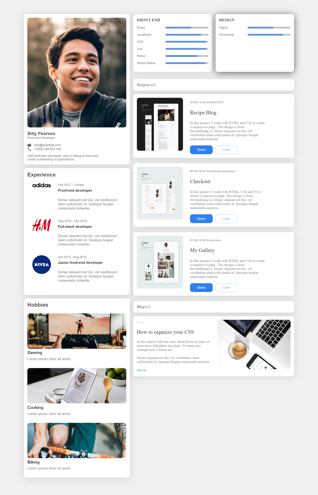

<!-- Please update value in the {}  -->

<h1 align="center">{Portfolio Website- Devchallenges.io}</h1>

   Solution for a challenge from  <a href="http://devchallenges.io" target="_blank">Devchallenges.io</a>.

  <h3>
    <a href="https://psargar616.github.io/portfolio/">
      Demo
    </a>
     | 
    <a href="https://github.com/Psargar616/portfolio">
      Solution
    </a>
     | 
    <a href="https://devchallenges.io/challenges/5ZnOYsSXM24JWnCsNFlt">
      Challenge
    </a>
  </h3>

<!-- TABLE OF CONTENTS -->

## Table of Contents

- [Overview](#overview)
  - [Built With](#built-with)
- [Features](#features)
- [Contact](#contact)
- [Acknowledgements](#acknowledgements)

<!-- OVERVIEW -->

## Overview

Created a beautiful responsive portfolio page using HTML and CSS. A portfolio is the most important certificate when applying for a job. The very purpose of your web developer portfolio is to showcase your work(experiences), projects, & education. Used CSS grids and flexbox to make website responsive. 

### Built With

- HTML
- CSS

## Features

<!-- List the features of your application or follow the template. Don't share the figma file here :) -->

This application/site was created as a submission to a [DevChallenges](https://devchallenges.io/challenges) challenge. The [challenge](https://devchallenges.io/challenges/5ZnOYsSXM24JWnCsNFlt) was to build an application to complete the given user stories.

Challenge: Create all the elements in the given designs and then create a portfolio with your own content. You can create your own layout. You can use React, Vue.js, or other libraries to create a reusable component, but it is not required. Don’t look at the existing solution. Fulfill user stories below:

- User story: I can see personal details
- User story: I can see skills
- User story: I can see projects
- User story: I can filter projects by tag
- User story: I can see hobbies or certificates
- User story (optional): I can see experiences
- User story (optional): I can see blogs
- User story (optional): I can see projects on different pages

## Acknowledgements

<!-- This section should list any articles or add-ons/plugins that helps you to complete the project. This is optional but it will help you in the future. For example: -->

- [Steps to replicate a design with only HTML and CSS](https://devchallenges-blogs.web.app/how-to-replicate-design/)
- [CSS Grids](https://developer.mozilla.org/en-US/docs/Web/CSS/grid-template-areas)

## Contact

- GitHub [@Psargar616](https://{github.com/your-usermame})
